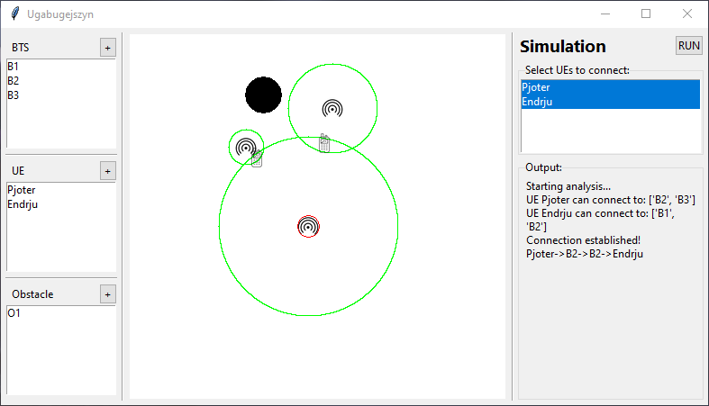

# KB simulator
An app built for the Wireless Communication course.



It lets you place base stations, recivers and obstacles in open space and check if a connection between devices can be achieved.

## Setup

[`requirements`](requirements.txt) file contains required Python packages. Use it by running ```py -m pip install -r requirements.txt```

## Usage

Run main.py and have fun :)